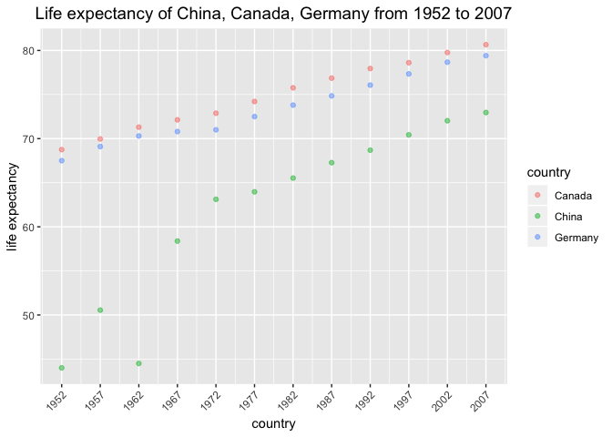
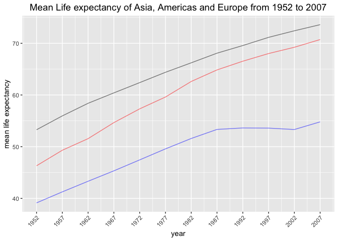

Homework 04 - Tidy data and joins
================

## Overview

I will finish the following tasks in this assignment.

  - **Data Reshaping Prompts (and relationship to aggregation)**
      - Make a tibble with one row per year and columns for life
        expectancy for two or more countries.
      - Compute mean values of life expectancy for all possible
        combinations of continent and year.
      - Form a tibble: 2 per year, giving the country with both the
        lowest and highest life expectancy in all continents. Take that
        table and reshape it so you have one row per year \* continent
        combination.
  - **Join Prompts (join, merge, look up)**
      - Create a second data frame, complementary to Gapminder. Join
        this with (part of) Gapminder using a dplyr join function and
        make some observations about the process and result. Explore the
        different types of joins.

First we need to load `gapminder` dataset and `tidyverse` package and
`knitr`package.

``` r
library(gapminder)
library(tidyverse)
```

    ## ── Attaching packages ───────────────────────────────────── tidyverse 1.2.1 ──

    ## ✔ ggplot2 3.0.0     ✔ purrr   0.2.5
    ## ✔ tibble  1.4.2     ✔ dplyr   0.7.6
    ## ✔ tidyr   0.8.1     ✔ stringr 1.3.1
    ## ✔ readr   1.1.1     ✔ forcats 0.3.0

    ## ── Conflicts ──────────────────────────────────────── tidyverse_conflicts() ──
    ## ✖ dplyr::filter() masks stats::filter()
    ## ✖ dplyr::lag()    masks stats::lag()

``` r
library(knitr)
```

## Data Reshaping Prompts (and relationship to aggregation)

#### Make a tibble with one row per year and columns for life expectancy for two or more countries

I want to compare life expectanct of China, Canada and Germany.

``` r
p1<-filter(gapminder, country %in% c('China','Germany','Canada'))%>%
  select(year,country,lifeExp)
kable(head(p1,10)) 
```

| year | country | lifeExp |
| ---: | :------ | ------: |
| 1952 | Canada  |   68.75 |
| 1957 | Canada  |   69.96 |
| 1962 | Canada  |   71.30 |
| 1967 | Canada  |   72.13 |
| 1972 | Canada  |   72.88 |
| 1977 | Canada  |   74.21 |
| 1982 | Canada  |   75.76 |
| 1987 | Canada  |   76.86 |
| 1992 | Canada  |   77.95 |
| 1997 | Canada  |   78.61 |

According to above table, we can see that it is not easy to compare life
expectancy for multiple countries in the same year. so now I want to
reshape this data into a new table using spread() function.

``` r
p2<-spread(p1,key = "country", value = "lifeExp") %>% 
  rename(ChinaLifeExp = China,
         GanadaLifeExp = Canada,
         GermanyLifeExp = Germany
         )
kable(p2)
```

| year | GanadaLifeExp | ChinaLifeExp | GermanyLifeExp |
| ---: | ------------: | -----------: | -------------: |
| 1952 |        68.750 |     44.00000 |         67.500 |
| 1957 |        69.960 |     50.54896 |         69.100 |
| 1962 |        71.300 |     44.50136 |         70.300 |
| 1967 |        72.130 |     58.38112 |         70.800 |
| 1972 |        72.880 |     63.11888 |         71.000 |
| 1977 |        74.210 |     63.96736 |         72.500 |
| 1982 |        75.760 |     65.52500 |         73.800 |
| 1987 |        76.860 |     67.27400 |         74.847 |
| 1992 |        77.950 |     68.69000 |         76.070 |
| 1997 |        78.610 |     70.42600 |         77.340 |
| 2002 |        79.770 |     72.02800 |         78.670 |
| 2007 |        80.653 |     72.96100 |         79.406 |

Now we can visiualize this data as a scatter plot.

``` r
ggplot(p1,aes(x=year,y=lifeExp))+
  geom_point(aes(color=country),alpha=0.5)+
  scale_x_continuous(limits=c(1952,2007),breaks=seq(1952,2007,5))+
  theme(axis.text.x = element_text(angle = 45, hjust = 1),
        plot.title = element_text(size=14,hjust=0.5))+
  labs(x="country",
       y="life expectancy",
       title="Life expectancy of China, Canada, Germany from 1952 to 2007")
```

<!-- -->

We can see from the above graph, three countries had an increasing trend
in life expectancies from 1952 until
2007.

#### Compute mean value of life expectancy for all possible combinations of continent and year.

I want to compute mean value of life expectancy for all combinations of
continent and year.

``` r
p3<-group_by(gapminder,continent,year)%>%
  summarize(meanLifeExp = mean(lifeExp))
p4<-spread(p3,key = "continent",value = "meanLifeExp")
kable(p4)
```

| year |   Africa | Americas |     Asia |   Europe | Oceania |
| ---: | -------: | -------: | -------: | -------: | ------: |
| 1952 | 39.13550 | 53.27984 | 46.31439 | 64.40850 | 69.2550 |
| 1957 | 41.26635 | 55.96028 | 49.31854 | 66.70307 | 70.2950 |
| 1962 | 43.31944 | 58.39876 | 51.56322 | 68.53923 | 71.0850 |
| 1967 | 45.33454 | 60.41092 | 54.66364 | 69.73760 | 71.3100 |
| 1972 | 47.45094 | 62.39492 | 57.31927 | 70.77503 | 71.9100 |
| 1977 | 49.58042 | 64.39156 | 59.61056 | 71.93777 | 72.8550 |
| 1982 | 51.59287 | 66.22884 | 62.61794 | 72.80640 | 74.2900 |
| 1987 | 53.34479 | 68.09072 | 64.85118 | 73.64217 | 75.3200 |
| 1992 | 53.62958 | 69.56836 | 66.53721 | 74.44010 | 76.9450 |
| 1997 | 53.59827 | 71.15048 | 68.02052 | 75.50517 | 78.1900 |
| 2002 | 53.32523 | 72.42204 | 69.23388 | 76.70060 | 79.7400 |
| 2007 | 54.80604 | 73.60812 | 70.72848 | 77.64860 | 80.7195 |

We can reshape this data into another
form.

``` r
spread(p3,key = "year", value = "meanLifeExp")%>%kable()
```

| continent |     1952 |     1957 |     1962 |     1967 |     1972 |     1977 |     1982 |     1987 |     1992 |     1997 |     2002 |     2007 |
| :-------- | -------: | -------: | -------: | -------: | -------: | -------: | -------: | -------: | -------: | -------: | -------: | -------: |
| Africa    | 39.13550 | 41.26635 | 43.31944 | 45.33454 | 47.45094 | 49.58042 | 51.59287 | 53.34479 | 53.62958 | 53.59827 | 53.32523 | 54.80604 |
| Americas  | 53.27984 | 55.96028 | 58.39876 | 60.41092 | 62.39492 | 64.39156 | 66.22884 | 68.09072 | 69.56836 | 71.15048 | 72.42204 | 73.60812 |
| Asia      | 46.31439 | 49.31854 | 51.56322 | 54.66364 | 57.31927 | 59.61056 | 62.61794 | 64.85118 | 66.53721 | 68.02052 | 69.23388 | 70.72848 |
| Europe    | 64.40850 | 66.70307 | 68.53923 | 69.73760 | 70.77503 | 71.93777 | 72.80640 | 73.64217 | 74.44010 | 75.50517 | 76.70060 | 77.64860 |
| Oceania   | 69.25500 | 70.29500 | 71.08500 | 71.31000 | 71.91000 | 72.85500 | 74.29000 | 75.32000 | 76.94500 | 78.19000 | 79.74000 | 80.71950 |

Now I will visiualize the data using line plot.

``` r
ggplot(p4,aes(x=year))+
  geom_line(aes(y=Asia),color = 'red', alpha = 0.5)+
  geom_line(aes(y=Africa),color = 'blue', alpha = 0.5)+
  geom_line(aes(y=Americas),color = 'black', alpha = 0.5)+
  scale_x_continuous(limits=c(1952,2007),breaks=seq(1952,2007,5))+
  theme(axis.text.x = element_text(angle = 45, hjust = 1),
        plot.title = element_text(size=14,hjust=0.5))+
  labs(x="year",
       y="mean life expectancy",
       title="Mean Life expectancy of Asia, Americas and Europe from 1952 to 2007")
```

<!-- -->

#### Form a tibble: 2 per year, giving the country with both the lowest and highest life expectancy in all continents. Take that table and reshape it so you have one row per year \* continent combination.

Firstly, we need to form this tibble.

``` r
p5<-group_by(gapminder,year,continent)%>%
  filter(min_rank(lifeExp)<2 | min_rank(desc(lifeExp))<2)%>%
  select(year,continent,country,lifeExp)
kable(head(p5,10))
```

| year | continent | country     | lifeExp |
| ---: | :-------- | :---------- | ------: |
| 1952 | Asia      | Afghanistan |  28.801 |
| 1957 | Asia      | Afghanistan |  30.332 |
| 1962 | Asia      | Afghanistan |  31.997 |
| 1967 | Asia      | Afghanistan |  34.020 |
| 1972 | Asia      | Afghanistan |  36.088 |
| 1982 | Asia      | Afghanistan |  39.854 |
| 1987 | Asia      | Afghanistan |  40.822 |
| 1992 | Asia      | Afghanistan |  41.674 |
| 1997 | Asia      | Afghanistan |  41.763 |
| 2002 | Asia      | Afghanistan |  42.129 |

Then we need to reshape above data into one row per year \* continent
combination.

``` r
p6<-group_by(p5,year,continent)%>%
  arrange(lifeExp)%>%
  mutate(min_lifeExp_Country = first(country), #first country has lowest life expectancy
         min_lifeExp = min(lifeExp), 
         max_lifeExp_Country = last(country), #last country has highest life expectancy
         max_lifeExp = max(lifeExp))%>%
  select(year, 
         continent,
         min_lifeExp_Country,
         min_lifeExp,
         max_lifeExp_Country,
         max_lifeExp) %>%
  unique()%>%
  arrange(year)%>%
  unite("year_continent",year,continent)
kable(head(p6,20))
```

| year\_continent | min\_lifeExp\_Country | min\_lifeExp | max\_lifeExp\_Country | max\_lifeExp |
| :-------------- | :-------------------- | -----------: | :-------------------- | -----------: |
| 1952\_Asia      | Afghanistan           |       28.801 | Israel                |       65.390 |
| 1952\_Africa    | Gambia                |       30.000 | Reunion               |       52.724 |
| 1952\_Americas  | Haiti                 |       37.579 | Canada                |       68.750 |
| 1952\_Europe    | Turkey                |       43.585 | Norway                |       72.670 |
| 1952\_Oceania   | Australia             |       69.120 | New Zealand           |       69.390 |
| 1957\_Asia      | Afghanistan           |       30.332 | Israel                |       67.840 |
| 1957\_Africa    | Sierra Leone          |       31.570 | Mauritius             |       58.089 |
| 1957\_Americas  | Haiti                 |       40.696 | Canada                |       69.960 |
| 1957\_Europe    | Turkey                |       48.079 | Iceland               |       73.470 |
| 1957\_Oceania   | New Zealand           |       70.260 | Australia             |       70.330 |
| 1962\_Asia      | Afghanistan           |       31.997 | Israel                |       69.390 |
| 1962\_Africa    | Sierra Leone          |       32.767 | Mauritius             |       60.246 |
| 1962\_Americas  | Bolivia               |       43.428 | Canada                |       71.300 |
| 1962\_Europe    | Turkey                |       52.098 | Iceland               |       73.680 |
| 1962\_Oceania   | Australia             |       70.930 | New Zealand           |       71.240 |
| 1967\_Asia      | Afghanistan           |       34.020 | Japan                 |       71.430 |
| 1967\_Africa    | Sierra Leone          |       34.113 | Mauritius             |       61.557 |
| 1967\_Americas  | Bolivia               |       45.032 | Canada                |       72.130 |
| 1967\_Europe    | Turkey                |       54.336 | Sweden                |       74.160 |
| 1967\_Oceania   | Australia             |       71.100 | New Zealand           |       71.520 |

This table looks
better.

## Join Prompts (join, merge, look up)

#### Create a second data frame, complementary to Gapminder. Join this with (part of) Gapminder using a dplyr join function and make some observations about the process and result. Explore the different types of joins.

I downloaded WHO dataset from
[website](http://www.exploredata.net/Downloads/WHO-Data-Set). This
dataset is too large so I decide to create a new data frame by just
selecting three columns from WHO dataset : country, democracy\_score and
children\_per\_woman.

``` r
new_data<-read_csv("WHO.csv")%>%
  select(country,democracy_score,children_per_woman) # selecting three columns from WHO data set to create a new data frame.
```

    ## Parsed with column specification:
    ## cols(
    ##   .default = col_double(),
    ##   country = col_character(),
    ##   CountryID = col_integer(),
    ##   Continent = col_integer(),
    ##   `Adolescent fertility rate (%)` = col_integer(),
    ##   `Gross national income per capita (PPP international $)` = col_integer(),
    ##   `Net primary school enrolment ratio female (%)` = col_integer(),
    ##   `Net primary school enrolment ratio male (%)` = col_integer(),
    ##   `Population (in thousands) total` = col_integer(),
    ##   `Population in urban areas (%)` = col_integer(),
    ##   `Population median age (years)` = col_integer(),
    ##   `Population proportion over 60 (%)` = col_integer(),
    ##   `Population proportion under 15 (%)` = col_integer(),
    ##   `Registration coverage of births (%)` = col_integer(),
    ##   `Antenatal care coverage - at least four visits (%)` = col_integer(),
    ##   `Antiretroviral therapy coverage among HIV-infected pregt women for PMTCT (%)` = col_integer(),
    ##   `Antiretroviral therapy coverage among people with advanced HIV infections (%)` = col_integer(),
    ##   `Births attended by skilled health personnel (%)` = col_integer(),
    ##   `Births by caesarean section (%)` = col_integer(),
    ##   `Neonates protected at birth against neonatal tetanus (PAB) (%)` = col_integer(),
    ##   `One-year-olds immunized with MCV` = col_integer()
    ##   # ... with 100 more columns
    ## )

    ## See spec(...) for full column specifications.

``` r
kable(head(new_data,10)) #just show 10 lines 
```

| country             | democracy\_score | children\_per\_woman |
| :------------------ | ---------------: | -------------------: |
| Afghanistan         |              \-7 |                 7.07 |
| Albania             |                9 |                 2.06 |
| Algeria             |                2 |                 2.38 |
| Andorra             |               NA |                   NA |
| Angola              |              \-2 |                 6.43 |
| Antigua and Barbuda |               NA |                   NA |
| Argentina           |                8 |                 2.25 |
| Armenia             |                5 |                 1.39 |
| Australia           |               10 |                 1.79 |
| Austria             |               NA |                 1.42 |

Next, join this new data frame with gapminder using the various `join`
functions.

**left
    join**

``` r
left_join(gapminder,new_data, by="country")
```

    ## Warning: Column `country` joining factor and character vector, coercing
    ## into character vector

    ## # A tibble: 1,704 x 8
    ##    country continent  year lifeExp    pop gdpPercap democracy_score
    ##    <chr>   <fct>     <int>   <dbl>  <int>     <dbl>           <int>
    ##  1 Afghan… Asia       1952    28.8 8.43e6      779.              -7
    ##  2 Afghan… Asia       1957    30.3 9.24e6      821.              -7
    ##  3 Afghan… Asia       1962    32.0 1.03e7      853.              -7
    ##  4 Afghan… Asia       1967    34.0 1.15e7      836.              -7
    ##  5 Afghan… Asia       1972    36.1 1.31e7      740.              -7
    ##  6 Afghan… Asia       1977    38.4 1.49e7      786.              -7
    ##  7 Afghan… Asia       1982    39.9 1.29e7      978.              -7
    ##  8 Afghan… Asia       1987    40.8 1.39e7      852.              -7
    ##  9 Afghan… Asia       1992    41.7 1.63e7      649.              -7
    ## 10 Afghan… Asia       1997    41.8 2.22e7      635.              -7
    ## # ... with 1,694 more rows, and 1 more variable: children_per_woman <dbl>

`left_join` adds the columns from the new\_data dataset to the gapminder
dataset based on country. This type of join preserves all data in the
first data frame and adds new columns from the second data frame to
matching rows.

**right
    join**

``` r
right_join(gapminder,new_data,by="country")
```

    ## Warning: Column `country` joining factor and character vector, coercing
    ## into character vector

    ## # A tibble: 1,698 x 8
    ##    country continent  year lifeExp    pop gdpPercap democracy_score
    ##    <chr>   <fct>     <int>   <dbl>  <int>     <dbl>           <int>
    ##  1 Afghan… Asia       1952    28.8 8.43e6      779.              -7
    ##  2 Afghan… Asia       1957    30.3 9.24e6      821.              -7
    ##  3 Afghan… Asia       1962    32.0 1.03e7      853.              -7
    ##  4 Afghan… Asia       1967    34.0 1.15e7      836.              -7
    ##  5 Afghan… Asia       1972    36.1 1.31e7      740.              -7
    ##  6 Afghan… Asia       1977    38.4 1.49e7      786.              -7
    ##  7 Afghan… Asia       1982    39.9 1.29e7      978.              -7
    ##  8 Afghan… Asia       1987    40.8 1.39e7      852.              -7
    ##  9 Afghan… Asia       1992    41.7 1.63e7      649.              -7
    ## 10 Afghan… Asia       1997    41.8 2.22e7      635.              -7
    ## # ... with 1,688 more rows, and 1 more variable: children_per_woman <dbl>

`right_join` adds the columns from gapminder dataset to the new\_data
dataset based on country. This type of join preserves all data in the
second data frame and adds new columns from the first data frame to
matching rows.

**inner
    join**

``` r
inner_join(gapminder,new_data,by="country")
```

    ## Warning: Column `country` joining factor and character vector, coercing
    ## into character vector

    ## # A tibble: 1,632 x 8
    ##    country continent  year lifeExp    pop gdpPercap democracy_score
    ##    <chr>   <fct>     <int>   <dbl>  <int>     <dbl>           <int>
    ##  1 Afghan… Asia       1952    28.8 8.43e6      779.              -7
    ##  2 Afghan… Asia       1957    30.3 9.24e6      821.              -7
    ##  3 Afghan… Asia       1962    32.0 1.03e7      853.              -7
    ##  4 Afghan… Asia       1967    34.0 1.15e7      836.              -7
    ##  5 Afghan… Asia       1972    36.1 1.31e7      740.              -7
    ##  6 Afghan… Asia       1977    38.4 1.49e7      786.              -7
    ##  7 Afghan… Asia       1982    39.9 1.29e7      978.              -7
    ##  8 Afghan… Asia       1987    40.8 1.39e7      852.              -7
    ##  9 Afghan… Asia       1992    41.7 1.63e7      649.              -7
    ## 10 Afghan… Asia       1997    41.8 2.22e7      635.              -7
    ## # ... with 1,622 more rows, and 1 more variable: children_per_woman <dbl>

`inner join` only retains observations that have a country in both
gapminder and new\_data.

**full
    join**

``` r
full_join(gapminder,new_data,by="country")
```

    ## Warning: Column `country` joining factor and character vector, coercing
    ## into character vector

    ## # A tibble: 1,770 x 8
    ##    country continent  year lifeExp    pop gdpPercap democracy_score
    ##    <chr>   <fct>     <int>   <dbl>  <int>     <dbl>           <int>
    ##  1 Afghan… Asia       1952    28.8 8.43e6      779.              -7
    ##  2 Afghan… Asia       1957    30.3 9.24e6      821.              -7
    ##  3 Afghan… Asia       1962    32.0 1.03e7      853.              -7
    ##  4 Afghan… Asia       1967    34.0 1.15e7      836.              -7
    ##  5 Afghan… Asia       1972    36.1 1.31e7      740.              -7
    ##  6 Afghan… Asia       1977    38.4 1.49e7      786.              -7
    ##  7 Afghan… Asia       1982    39.9 1.29e7      978.              -7
    ##  8 Afghan… Asia       1987    40.8 1.39e7      852.              -7
    ##  9 Afghan… Asia       1992    41.7 1.63e7      649.              -7
    ## 10 Afghan… Asia       1997    41.8 2.22e7      635.              -7
    ## # ... with 1,760 more rows, and 1 more variable: children_per_woman <dbl>

`full join` preserves all data from both data sets. It will create the
largest data frame with lots of NULL data.

**semi
    join**

``` r
semi_join(gapminder,new_data)
```

    ## Joining, by = "country"

    ## Warning: Column `country` joining factor and character vector, coercing
    ## into character vector

    ## # A tibble: 1,632 x 6
    ##    country     continent  year lifeExp      pop gdpPercap
    ##    <fct>       <fct>     <int>   <dbl>    <int>     <dbl>
    ##  1 Afghanistan Asia       1952    28.8  8425333      779.
    ##  2 Afghanistan Asia       1957    30.3  9240934      821.
    ##  3 Afghanistan Asia       1962    32.0 10267083      853.
    ##  4 Afghanistan Asia       1967    34.0 11537966      836.
    ##  5 Afghanistan Asia       1972    36.1 13079460      740.
    ##  6 Afghanistan Asia       1977    38.4 14880372      786.
    ##  7 Afghanistan Asia       1982    39.9 12881816      978.
    ##  8 Afghanistan Asia       1987    40.8 13867957      852.
    ##  9 Afghanistan Asia       1992    41.7 16317921      649.
    ## 10 Afghanistan Asia       1997    41.8 22227415      635.
    ## # ... with 1,622 more rows

`semi join` filters the gapminder dataset that includes countries that
are in the new\_data dataset. It does not actually join the two datasets
together.

**anti
    join**

``` r
anti_join(gapminder,new_data)
```

    ## Joining, by = "country"

    ## Warning: Column `country` joining factor and character vector, coercing
    ## into character vector

    ## # A tibble: 72 x 6
    ##    country continent  year lifeExp      pop gdpPercap
    ##    <fct>   <fct>     <int>   <dbl>    <int>     <dbl>
    ##  1 Iran    Asia       1952    44.9 17272000     3035.
    ##  2 Iran    Asia       1957    47.2 19792000     3290.
    ##  3 Iran    Asia       1962    49.3 22874000     4187.
    ##  4 Iran    Asia       1967    52.5 26538000     5907.
    ##  5 Iran    Asia       1972    55.2 30614000     9614.
    ##  6 Iran    Asia       1977    57.7 35480679    11889.
    ##  7 Iran    Asia       1982    59.6 43072751     7608.
    ##  8 Iran    Asia       1987    63.0 51889696     6643.
    ##  9 Iran    Asia       1992    65.7 60397973     7236.
    ## 10 Iran    Asia       1997    68.0 63327987     8264.
    ## # ... with 62 more rows

`anti join` filters the gapminder dataset that includes countries that
are not in the new\_data dataset. It also does not join the two datasets
together.
